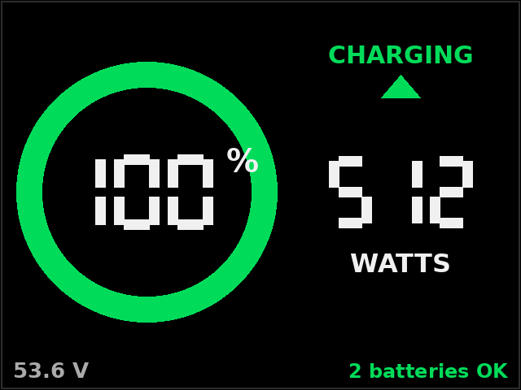

# HumsiENK BLE Battery Monitor

**A screen my parents can read at a glance, and every last data point for the Home Assistant obsessive (me) under the hood — straight off Bluetooth. No vendor app, no cloud account, no Raspberry Pi.**

[](LICENSE)
[](https://github.com/arlak-lang/humsienk-ble-monitor/commits/main)
[](https://github.com/arlak-lang/humsienk-ble-monitor/stargazers)

[](cyd_monitor/)
[](cyd_monitor/platformio.ini)
[](cyd_monitor/MQTT_SETUP.md)
[](python/)

[](#)
[](#)
[](#)

<p align="center">
  
  <br><em>the whole point: a number, at a glance</em>
</p>

---

## Why this exists

Two very different people look at these batteries.

**My parents**, who want to glance at a screen and know *"are we good?"* — a big number, a color, done. They are never going to open an app, make an account, or care what a cell voltage is. Nor should they.

**Me**, who wants every cell voltage, every temperature, and amps trending in **Home Assistant** so I can obsess over it properly and get an alert before anything goes sideways.

The manufacturer's answer to both of us is the same phone app: an account, a cloud round-trip, one battery at a time, and nothing my parents will ever open twice. I have enough logins. I did not want a Raspberry Pi and a subscription-flavored dashboard sitting between me and a state-of-charge percentage.

So I did what tired sysadmins do at 11pm: sniffed the protocol, wrote it down, and cut the app out of the loop. Now there's a cheap screen on the wall for the humans, and a firehose of MQTT for the nerd. Everyone's happy, nobody's logged in.

---

## What it does

- **Reads the batteries directly over BLE** — SOC, pack voltage, current, power, **every cell voltage**, temperatures, capacity, cycles. No app, no cloud, no middleman.
- **A dead-simple panel for humans** — the screen shows a big charge ring + watts + charging/discharging, and nothing else. Simple enough that the people who *use* the power don't have to understand any of it.
- **The full firehose for the nerd** — every reading is published to **Home Assistant** via MQTT auto-discovery (~34 sensors per battery). Graph it, alert on it, automate it.
- **Genuinely standalone** — one ESP32 does the Bluetooth, the screen, *and* the MQTT. Nothing else has to be powered on. No Pi. No Solar Assistant. No PC babysitting a dongle.
- **1, 2, or however many batteries** you have — nothing's hardcoded to a magic number.

---

## Hardware

### The batteries

HumsiENK / Shenzhen Shake World **48 V 100 Ah "Golf Cart" Bluetooth LiFePO₄** — the metal-cased "IronGuard / Smart Edition". The numbers that matter:

| Spec | Value |
|------|-------|
| Nominal | **51.2 V · 100 Ah · 5.12 kWh** (16S LiFePO₄) |
| BMS | **200 A**, with over/under-voltage, over-current, high/low-temp, and short-circuit protection |
| Cycle life | **6000 cycles @ 80% DoD**, ≤ 3%/month self-discharge |
| Charge | 57.6 V CC/CV, 20 A recommended (100 A max), 0–45 °C |
| Discharge | 40 V cutoff, 50 A recommended (200 A max), −20–65 °C |
| Build | Metal shell, **IP65**, ~90 lb (41 kg), M8 terminals, 593 × 266 × 217 mm |
| The important bit | it has a **BLE module** (HopeRF) — identified by BLE name = serial number = the QR sticker |

Full datasheet at [humsienk.com](https://www.humsienk.com). (Values are typical, per the manufacturer.)

### The screen

I used the **ELEGOO 2-Pack ESP32 2.8" Touch Screen Display** — [Amazon B0FJQ6RK39](https://www.amazon.com/dp/B0FJQ6RK39) — which comes with a little acrylic stand. It's a "**CYD**" (Cheap Yellow Display): an ESP32-2432S028R with a 320 × 240 ILI9341 touchscreen, ~$10–15 each. The trick is that it has **both WiFi *and* BLE**, so a single board does the Bluetooth reading, the display, and the MQTT publishing. Any equivalent CYD should work.

### A computer (optional)

Only needed to flash the screen and/or run the Python tools. After that, unplug it — the ESP32 is the entire system and runs off any USB power.

---

## Getting started

You don't need to be an embedded dev. Here's the whole thing, in order.

### What you'll need

- One or more of the batteries, powered on and in Bluetooth range.
- A CYD screen (link above) and a USB-C cable.
- A computer with **Python 3** — just for setup.
- *(For Home Assistant)* an MQTT broker — the Mosquitto add-on is easiest.

### 1 · Prove it works from your laptop first

Before flashing anything, make sure your computer can actually see a battery:

```bash
git clone https://github.com/arlak-lang/humsienk-ble-monitor.git
cd humsienk-ble-monitor/python
python3 -m venv .venv && ./.venv/bin/pip install -r requirements.txt
python3 test_watt.py                        # sanity check — unit tests, no hardware needed
./.venv/bin/python watt_read.py HS --name   # reads the first battery whose name starts "HS"
```

You should get voltage, SOC, and all 16 cell voltages printed out. If you do, the hard part is over.
**Gotcha:** these batteries only talk to one thing at a time — if the vendor app is connected on your
phone, the battery goes invisible to everything else. Fully close it first.

### 2 · Flash the screen

1. Find each battery's **name** — it's the serial on the QR sticker (starts with `HS…`).
2. Copy the config template and fill it in:
   ```bash
   cd ../cyd_monitor
   cp src/config.example.h src/config.h
   ```
   Edit `src/config.h`: your WiFi SSID/password, your MQTT broker + login, and list each battery's
   name in the `BATTERIES[]` array.
3. Install PlatformIO, plug the CYD into USB, and flash:
   ```bash
   pip install platformio
   pio run -t upload
   ```
4. The screen boots, finds the batteries, and draws the ring. Unplug it from the computer — it now
   runs standalone on any USB charger.

### 3 · Wire it into Home Assistant

1. Install the **Mosquitto broker** add-on and add the login you put in `config.h`
   (step-by-step in [`cyd_monitor/MQTT_SETUP.md`](cyd_monitor/MQTT_SETUP.md)).
2. Make sure HA's **MQTT integration** is enabled.
3. Done — the batteries show up as devices with ~34 sensors each. No YAML, no restart.

**Don't want to flash anything?** The `python/mqtt_bridge.py` does the exact same HA publishing from a
computer that stays on — handy for testing, or if you don't have a screen yet.

### More than two batteries?

Nothing's fixed at two. Firmware: list them in `BATTERIES[]` in `config.h` (for **4+**, bump
`CONFIG_BT_NIMBLE_MAX_CONNECTIONS` in `platformio.ini`). Bridge: list them under `batteries:` in
`config.yaml`. CLI: `watt_dual.py <name1> <name2> ...` takes as many as you give it.

---

## How it actually talks

The batteries speak a Tuya/Modbus-flavored dialect I've been calling **WATT/HiLink**. The one thing
that unlocks it: after connecting, write the ASCII bytes **`HiLink`** to characteristic `fffa`. Then
it's polite:

- Service `fff0`, notify `fff1`, write `fff2`, auth `fffa`
- Frames: `7E 00 01 03 <addr:u16> <count:u16> <crc16-modbus> 0D`
- Read data-point **140 (`0x8C`)** → cell count, cell voltages, temps, current, voltage, capacities, cycles, SOC

The full map (and the two evenings of wrong turns it took to find it) is in
[`FINDINGS.md`](FINDINGS.md); the intent, architecture, and roadmap are in
[`PROJECT_SCOPE.md`](PROJECT_SCOPE.md).

---

## Tech stack

| Layer | What |
|-------|------|
| Firmware | ESP32 (Arduino / PlatformIO), NimBLE-Arduino (BLE central), LovyanGFX (display), PubSubClient + ArduinoJson (MQTT) |
| Protocol | Reverse-engineered WATT/HiLink over BLE GATT; Modbus-style framing, CRC-16/Modbus |
| Tools | Python 3 + `bleak` (BLE), `paho-mqtt` + `pyyaml` (the HA bridge) |
| Home | MQTT + Home Assistant auto-discovery. Broker of your choice — mine's the Mosquitto add-on. |

---

## Disclaimer / the boring-but-important part

Not affiliated with, endorsed by, or blessed by HumsiENK / Shenzhen Shake World. The protocol was
worked out from a battery **I own**, purely so it would interoperate with **my** house — which is what
reverse-engineering for interoperability is *for*. This repo ships **no** vendor app, firmware, or
decompiled code: just an independent description and a clean implementation.

It **only ever reads** — it never writes settings, toggles FETs, or otherwise pokes your BMS. LiFePO₄
packs store a frightening amount of energy; you are the adult in the room. **No warranty.** If the
vendor has concerns, open an issue and I'll be reasonable.

---

## Credits

Built on the shoulders of people who also refuse to accept closed ecosystems:
[`aiobmsble`](https://github.com/patman15/aiobmsble) (the sibling *BMC* protocol — a red herring for my
units, but it lit the path), [NimBLE-Arduino](https://github.com/h2zero/NimBLE-Arduino),
[LovyanGFX](https://github.com/lovyan03/LovyanGFX), and the whole CYD tinkering community.

## License

[MIT](LICENSE) — take it, fork it, put it on your own battery, tell your friends. Copyright © 2026 arlak-lang.

## Author

**arlak-lang** — a tired IT guy who would rather spend a weekend reading someone else's BLE stack than
open one more phone app. [GitHub](https://github.com/arlak-lang)
